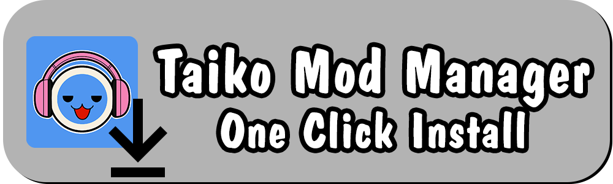

# RF.CustomPlaylists
 A Rhythm Festival mod to create custom playlists.
 
 
 
 This mod was mainly created for use by other mods to create their own playlists. However, you can create Json files to define your own playlists as well. Use the Template.json that's generated as a guide. 
 
 
 
# Requirements
 Visual Studio 2022 or newer\
 Taiko no Tatsujin: Rhythm Festival
 
 
# Build
 Install [BepInEx 6.0.0-pre.2](https://github.com/BepInEx/BepInEx/releases/tag/v6.0.0-pre.2) into your Rhythm Festival directory and launch the game.\
 This will generate all the dummy dlls in the interop folder that will be used as references.\
 Make sure you install the Unity.IL2CPP-win-x64 version.\
 Newer versions of BepInEx could have breaking API changes until the first stable v6 release, so those are not recommended at this time.
 
 Attempt to build the project, or copy the .csproj.user file from the Resources file to the same directory as the .csproj file.\
 Edit the .csproj.user file and place your Rhythm Festival file location in the "GameDir" variable.

# Links 
 [My Other Rhythm Festival Mods](https://docs.google.com/spreadsheets/d/1xY_WANKpkE-bKQwPG4UApcrJUG5trrNrbycJQSOia0c)\
 [My Taiko Discord Server](https://discord.gg/6Bjf2xP)
 
